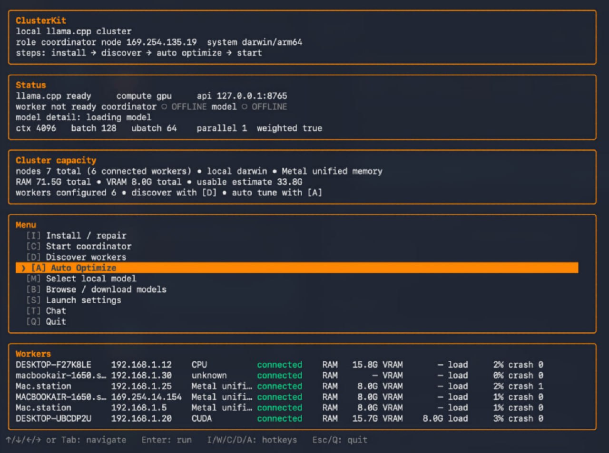

# ClusterKit

ClusterKit is a small local-first app for running `llama.cpp` with RPC workers on a LAN. It gives you a terminal UI and a browser UI for starting workers, starting a coordinator, selecting/downloading GGUF models, tuning launch settings, chatting, and exposing an OpenAI-compatible API.

> [!WARNING]
> ## Vibe-coding attention
> ClusterKit was vibe-coded for internal/personal use first. It may contain bugs, rough edges, wrong assumptions, unstable defaults, or outright mistakes. Review the commands it runs, test on your own hardware, and do not expose it to untrusted networks without understanding the risks.

## What it does

- Runs a **Worker** node that shares compute through `llama.cpp` `rpc-server`.
- Runs a **Coordinator** node that starts `llama-server`, connects to workers, and serves chat/API traffic.
- Provides both:
  - terminal UI by default;
  - browser UI with `--web`.
- Installs/repairs required `llama.cpp` tooling from inside the app where supported.
- Searches Hugging Face for GGUF models, downloads files, selects local models, and clears local model cache.
- Discovers ClusterKit peers on the same LAN.
- Lets you tune inference settings: context, batch, ubatch, threads, parallelism, GPU/RPC layers, split mode, tensor split, memory mode, coordinator-local compute, chat timeout, and token limits.
- Lets you configure **load distribution** manually:
  - enable/disable workers;
  - reorder workers;
  - set per-worker layer counts / split weights;
  - include or exclude coordinator-local layers.
- Streams chat responses in the UI.
- Exposes an OpenAI-compatible API on the ClusterKit app port.


## Interface example

Terminal UI example with coordinator status, cluster capacity, launch settings, actions, and connected workers:



## Performance note

Informal local test, not a benchmark suite:

| Setup | Model | Quant | Behavior |
|---|---:|---:|---|
| Solo computer, 8 GB VRAM | Qwen 3.5 9B | Q6 | Generation starts around **9 tok/s**, then gradually streams down toward **0.1 tok/s** as context fills. |
| LAN cluster, 8 GB VRAM + 6 GB VRAM | Qwen 3.5 9B | Q6 | Holds about **3.5 tok/s** steadily until the context limit. |

These numbers depend heavily on drivers, `llama.cpp` build, quant, context size, split settings, network, and hardware.

## Requirements

- macOS or Windows.
- Machines on the same trusted LAN.
- `llama.cpp` build with RPC support (`GGML_RPC=ON`), or use the in-app install/repair flow where available.
- A GGUF model.

Default ports:

| Purpose | Port |
|---|---:|
| ClusterKit UI / OpenAI-compatible API | `8765` |
| Coordinator `llama-server` API | `8080` |
| Worker `rpc-server` | `50052` |
| LAN discovery UDP | `47777` |

## Build

```bash
go build ./cmd/clusterkit
```

Run from source:

```bash
go run ./cmd/clusterkit
```

Run the browser UI:

```bash
go run ./cmd/clusterkit --web
```

Run without opening a browser automatically:

```bash
go run ./cmd/clusterkit --no-browser
```

## Packaging

macOS:

```bash
./scripts/package-macos.sh
./scripts/package-macos-dmg.sh
```

Windows PowerShell:

```powershell
.\scripts\package-windows.ps1
```

Artifacts are written to `dist/`.

## How to operate

### 1. Start worker machines

On each machine that should contribute compute:

1. Launch ClusterKit.
2. Choose **Worker**.
3. On Windows, choose GPU or CPU when prompted.
4. Use **Install/Repair** if `llama.cpp` tools are missing.
5. Start the worker.

The worker exposes `rpc-server` on port `50052` by default.

### 2. Start the coordinator

On the machine that should host the model and API:

1. Launch ClusterKit.
2. Choose **Coordinator**.
3. Use **Discover** to find LAN workers, or add worker host/port manually.
4. Select or download a GGUF model.
5. Tune launch settings:
   - context;
   - GPU/RPC layers;
   - split mode;
   - tensor split;
   - coordinator-local compute on/off;
   - per-worker layers / load weights.
6. Start the coordinator.
7. Use the built-in chat or connect an OpenAI-compatible client.

### Terminal UI hotkeys

Common controls:

- `↑/↓` or `Tab` — move selection.
- `Enter` — activate selected action.
- `I` — install/repair dependencies.
- `D` — discover LAN workers.
- `C` — start/stop coordinator.
- `W` — start/stop worker.
- `M` — select local model.
- `B` — browse/download models.
- `S` — settings.
- `L` — worker layer/load distribution screen.
- `Q` or `Esc` — quit/back.

Worker layer/load distribution screen:

- `↑/↓` — select local coordinator or worker row.
- `←/→` — adjust layers.
- `Shift+←/→` — adjust faster.
- `0` — set selected row to zero layers.
- `E` — enable/disable worker.
- `A` — auto-seed layers by estimated usable memory.
- `R` — reset manual layer plan.
- `Ctrl+↑/Ctrl+↓` — reorder workers.

## OpenAI-compatible API

ClusterKit exposes an OpenAI-compatible API on the app port:

```text
http://127.0.0.1:8765/v1
```

Supported endpoints include:

- `GET /v1/models`
- `POST /v1/chat/completions`
- `POST /v1/completions`
- `GET /health`

Example:

```bash
curl http://127.0.0.1:8765/v1/chat/completions \
  -H 'Content-Type: application/json' \
  -d '{
    "model": "local",
    "messages": [{"role": "user", "content": "Say hello from ClusterKit"}],
    "stream": true
  }'
```

Use `http://127.0.0.1:8765/v1` as the base URL in clients that support OpenAI-compatible local providers.

## Security notes

- Treat the LAN RPC path as trusted-network only.
- Do not expose ClusterKit, `llama-server`, or `rpc-server` directly to the public internet.
- The app starts local processes and downloads model/tooling assets; inspect logs and paths if you are packaging or redistributing it.
- Generated binaries and packages are intentionally ignored by git.

## Repository hygiene

The source repository should contain source code and scripts only. Build outputs, packaged apps, downloaded models, local configs, logs, and OS metadata should stay out of git.

## License

MIT License. See [LICENSE](LICENSE).
